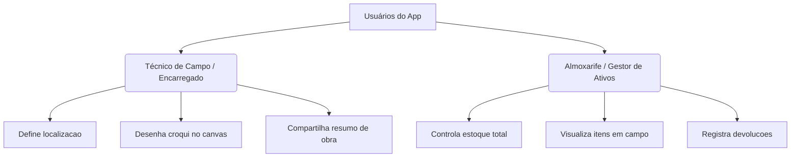

# Documento de Requisitos do Produto (PRD) - SinalizaExpress

---

## 1. Visão Geral do Produto

O **SinalizaExpress** é um aplicativo web progressivo (PWA) de natureza *mobile-first*, concebido para otimizar o processo de planejamento, controle e registro de sinalizações temporárias de trânsito. O aplicativo destina-se a equipes operacionais que realizam intervenções físicas e obras nas vias públicas (como implantação de redes de água, esgoto, reparos e escavações). 

### 1.1. Problema
O planejamento de sinalização em intervenções de rua frequentemente carece de padronização, agilidade no compartilhamento e controle de estoque de ativos caros (como placas regulamentares, cones e sinalizadores). A falta de um croqui claro e georreferenciado pode levar a falhas de segurança, multas dos órgãos de trânsito ou perdas constantes de materiais do almoxarifado.

### 1.2. Solução
Uma plataforma de campo onde o técnico pode:
1. Identificar geograficamente o ponto da obra via GPS ou portal GIS corporativo.
2. Levantar os equipamentos necessários a partir do estoque disponível.
3. Desenhar rapidamente um croqui interativo sobre o layout da via.
4. Compartilhar instantaneamente o plano de sinalização via WhatsApp e salvar o histórico de movimentação de materiais.

---

## 2. Personas e Público-Alvo

*   **Técnico Operacional / Encarregado da Obra:** Profissional na via pública responsável por sinalizar o local antes de iniciar a escavação/manutenção. Precisa de uma ferramenta robusta para celular que funcione offline e permita montar o croqui sob a luz solar direta em poucos minutos.
*   **Almoxarife / Gestor de Logística:** Responsável por manter e controlar a frota física de sinalização do centro operacional. Precisa saber a exata quantidade de cones e placas alocadas em cada obra e registrar o retorno seguro destes materiais.

---

## 3. Requisitos Funcionais

O SinalizaExpress está estruturado em **cinco fluxos/módulos principais** sequenciais e de suporte:

### 3.1. Identificação Geográfica (Local da Obra)
*   **GPS e Geolocalização Ativa:** Permite capturar as coordenadas físicas (`latitude` e `longitude`) do dispositivo móvel do usuário em tempo real.
*   **Geocodificação Reversa:** Conversão automática de coordenadas de satélite em endereços físicos compreensíveis através da API pública **Nominatim (OpenStreetMap)**.
*   **Barra de Pesquisa:** Busca de endereços urbanos para planejamento remoto de sinalização de intervenções futuras.
*   **Mapa Corporativo Integrado:** Exibição do portal de georreferenciamento interno da **Iguá Saneamento** (`gis.iguasa.com.br`) por meio de iframe integrado para suporte de campo avançado.

### 3.2. Checklist & Seleção de Equipamentos
*   **Itens Padronizados:** O sistema pré-carrega 15 itens essenciais e regulamentares de sinalização viária (como placas de "Homens Trabalhando", "Vala Aberta", "Estreitamento de Via", cavaletes, cones de 750mm, fitas, veículos barreira, entre outros).
*   **Itens Personalizados (Custom Signs):** O técnico de campo pode cadastrar novas placas personalizadas que não fazem parte do catálogo padrão.
*   **Integração e Validação com Estoque:** Ao ajustar a quantidade de um item no checklist, o aplicativo consulta a quantidade restante em estoque:
    *   Exibe a contagem física disponível para cada ativo controlado.
    *   Bloqueia a adição e exibe um alerta de atenção (ícone amarelo/vermelho) caso a quantidade demandada ultrapasse o estoque físico disponível.
*   **Observações Técnicas:** Bloco para digitação livre de cuidados e perigos adicionais (ex: "Fiação aérea baixa", "Fluxo intenso de ônibus").

### 3.3. Editor Gráfico de Croqui (Desenho Interativo)
*   **Quadro Branco Virtual (Canvas):** Alimentado pela biblioteca `react-konva` com suporte a gestos de toque em tela de celular.
*   **Ferramentas e Elementos Disponíveis:**
    *   *Estradas:* Segmentos de asfalto verticais e horizontais com faixas divisórias brancas.
    *   *Placas:* Sinalização de obras, velocidade máxima (40 km/h), pare, pare/siga, estreitamento de via, vala aberta, informações personalizadas.
    *   *Dispositivos delimitadores:* Cones, cavaletes, cerquites (tapumes de malha plástica), fita zebrada de isolamento e sinalizador luminoso.
    *   *Logística:* Desenhos de caminhão barreira, retroescavadeira, escavação aberta (vala) e trabalhadores.
    *   *Apoio visual:* Setas direcionais de fluxo de tráfego e caixas de texto flutuantes editáveis.
*   **Operações do Editor:** Permite selecionar, mover, rotacionar, redimensionar e excluir elementos individualmente através de um transformador gráfico, além de contar com recurso de **Desfazer (Undo)** de ações e **Limpar Tudo**.
*   **Exportação em Imagem:** Ao prosseguir, o canvas é convertido de forma assíncrona para uma imagem PNG (`Data URL` de alta definição com pixelRatio duplicado) e anexado ao relatório.

### 3.4. Resumo e Compartilhamento de Operação
*   **Ficha Consolidada:** Apresentação clara de todos os dados gerados (localização, link do Google Maps para rota, itens utilizados e quantidades, observações do responsável, croqui visual e identificação do técnico).
*   **API Web Share (Compartilhamento Nativo):** O aplicativo tenta compartilhar o arquivo de imagem PNG do croqui e o texto do relatório diretamente com aplicativos nativos de mensagens (WhatsApp, Teams, e-mail).
*   **Compartilhamento via link (WhatsApp Fallback):** Caso o dispositivo não suporte o compartilhamento nativo de imagens pela Web Share API, o app converte o texto para URL codificada e abre uma conversa no WhatsApp Web/App com a formatação de texto estruturada.
*   **Nova Obra:** Opção para limpar o formulário atual sem alterar o histórico ou o inventário para início de um novo plano.

### 3.5. Gestão de Inventário (Estoque de Sinalização)
*   **Visão de Saldos:** Exibe a relação de materiais controlados, identificando:
    *   *Estoque Total:* Quantidade física de posse do centro operacional.
    *   *Em Campo:* Quantidade atualmente alocada em obras ativas.
    *   *Disponível:* Saldo livre calculado pela fórmula `Estoque Total - Em Campo`.
*   **Adição de Itens:** Permite incluir novos lotes de placas padrão ou itens customizados.
*   **Ações de Edição e Exclusão:**
    *   Edição de quantidade total limitada para não ser inferior aos itens já em uso no campo.
    *   Bloqueio absoluto na remoção de itens que tenham unidades ativas em obras nas ruas.

### 3.6. Histórico de Obras & Gestão de Devoluções
*   **Registro Histórico Local:** Armazenamento seguro de todos os planejamentos de obras enviados, contendo os snapshots do estoque e imagens dos croquis.
*   **Ciclo de Devolução:** Ações para devolução do material:
    *   Uma obra no histórico é marcada como pendente até que a sinalização seja devolvida ao almoxarifado.
    *   O almoxarife ou o próprio técnico aciona a opção "Devolver sinalização" na obra correspondente.
    *   O sistema lê as quantidades usadas naquela obra, decrementa o contador "Em campo" do inventário correspondente e atualiza o status no histórico para "Devolvido em [Data]".

---

## 4. Requisitos Não Funcionais

### 4.1. Offline-First & Persistência Local
*   O aplicativo deve garantir operação ininterrupta mesmo em áreas de sombra de cobertura de sinal celular (comum em escavações profundas ou periferias).
*   **Armazenamento Híbrido:**
    *   `localStorage` é utilizado para manter o rascunho temporário do planejamento ativo, protegendo os dados se a página for recarregada acidentalmente.
    *   `localforage` (com preferência a IndexedDB) é empregado para gerenciar o Histórico e o Estoque de Materiais, garantindo capacidade de armazenamento estável para dezenas de croquis pesados em formato Base64.
*   **Instalação como PWA:** Uso de arquivos de `manifest.json` e `sw.js` (service worker pré-compilado) para permitir a instalação do atalho na tela inicial e execução em sandbox independente do navegador.

### 4.2. Tecnologia e Arquitetura
*   **Framework Principal:** Next.js (Versão 16+ com App Router).
*   **Desenho Gráfico:** `react-konva` e biblioteca nativa `konva` para gerenciamento do Canvas 2D.
*   **Bibliotecas Auxiliares:** `lucide-react` para os ícones e `localforage` para banco de dados do navegador.
*   **Estilização:** CSS utilitário com TailwindCSS e suporte a `@tailwindcss/postcss`.

### 4.3. Interface com Foco em Mobile-First
*   Todo o fluxo de telas está enquadrado e limitado a um layout container de dispositivo móvel (`max-w-md mx-auto`) com barra de progresso visual de etapas na parte superior e botões ergonômicos na parte inferior da viewport.

---

## 5. Próximos Passos & Escopo de Evolução (Roadmap)

1.  **Sincronização em Nuvem (Multi-Dispositivo):** Integração com back-end em tempo real (Supabase ou Firebase) para centralização de dados de obras e inventários de diferentes equipes operacionais.
2.  **Exportação Formal em PDF:** Emissão de relatórios estruturados de segurança no trânsito em PDF para anexação em processos administrativos e de auditoria municipal.
3.  **Mapa Interativo do Inventário:** Identificação visual no mapa de onde exatamente estão localizados os cones e placas no município em tempo real com base nas obras ativas.
